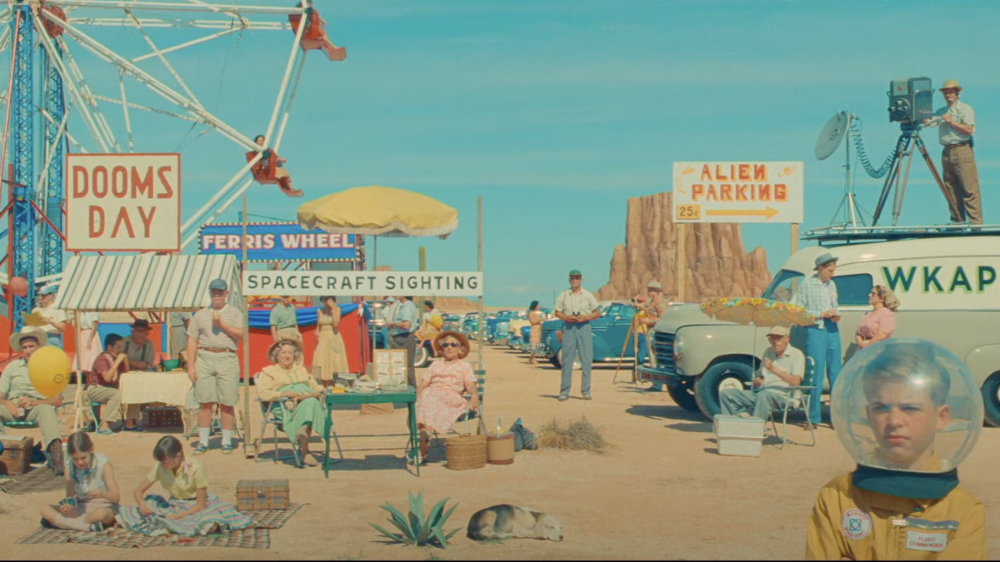
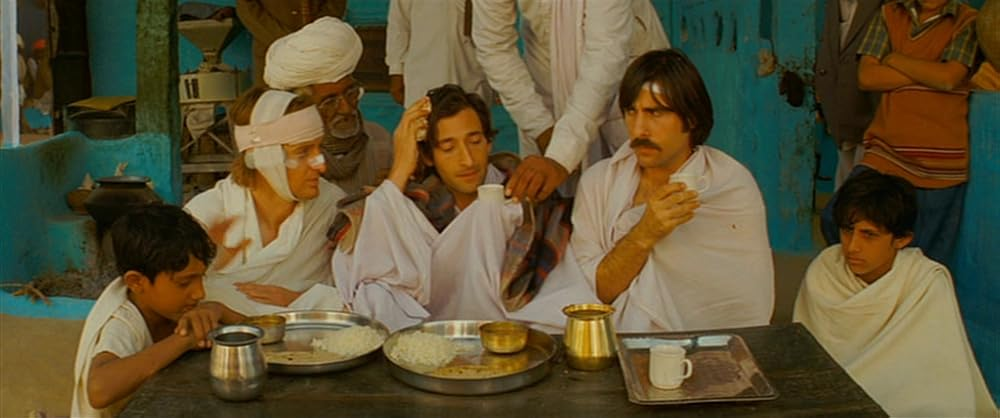

# Wes Anderson Scheme for [Base16](http://chriskempson.com/projects/base16/)

A set of dark themes for [Base16](http://chriskempson.com/projects/base16/)
inspired by the R package [Wes Anderson
Palettes](https://github.com/karthik/wesanderson) and the beautiful colors in
the movies by the director Wes Anderson.

## Asteroid City (2023)

## Bottle Rocket (1996)

## Darjeeling Limited (2007)

