# Wes Anderson Scheme for [Base16](http://chriskempson.com/projects/base16/)

A set of dark themes for [Base16](http://chriskempson.com/projects/base16/)
inspired by the R package [Wes Anderson
Palettes](https://github.com/karthik/wesanderson) and the beautiful colors in
the movies by the director Wes Anderson.

## Asteroid City (2023)

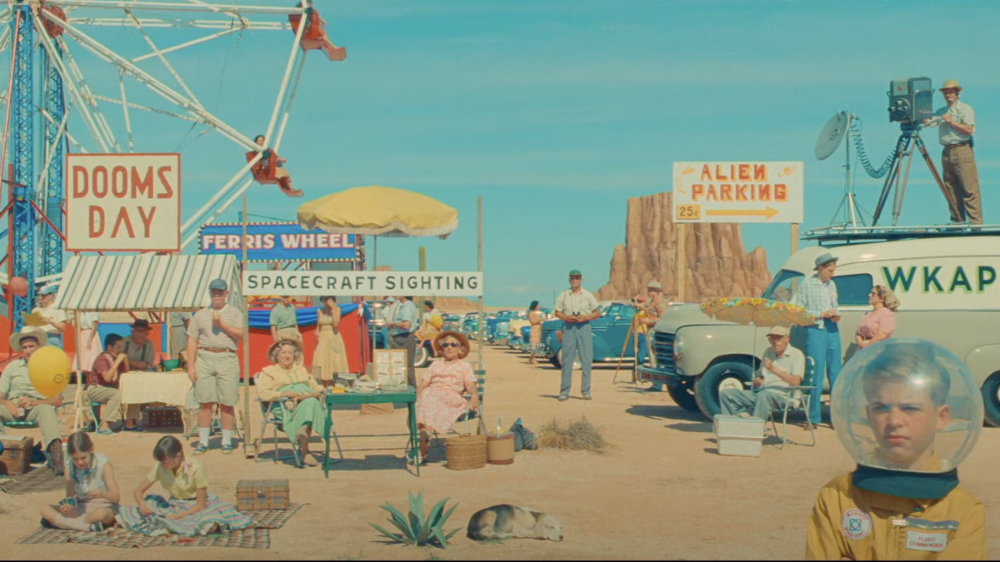

## Bottle Rocket (1996)

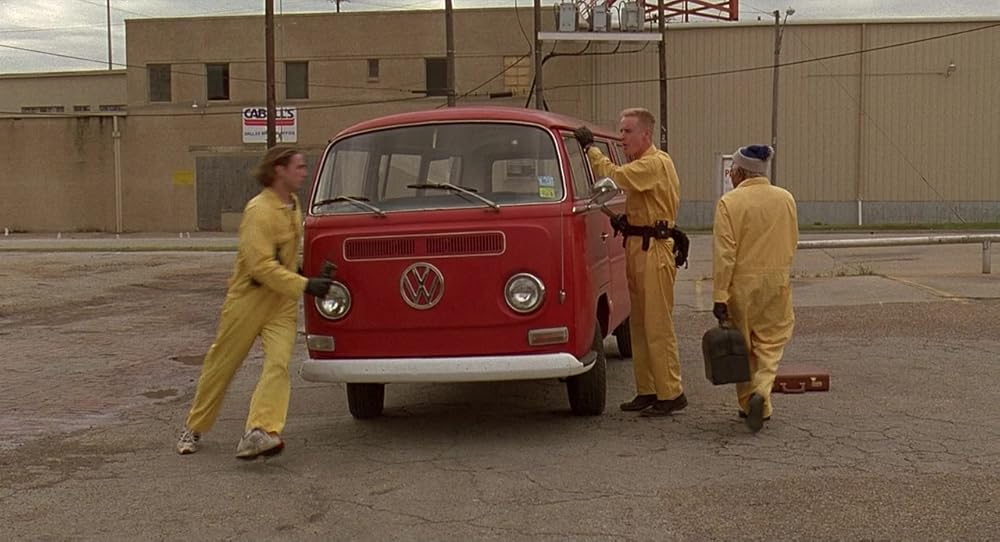

## Darjeeling Limited (2007)

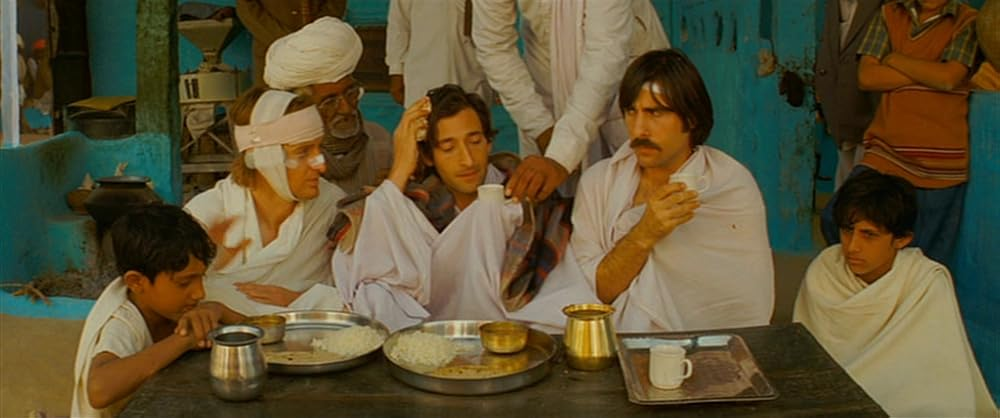

## Fantastic Mr. Fox (2009)

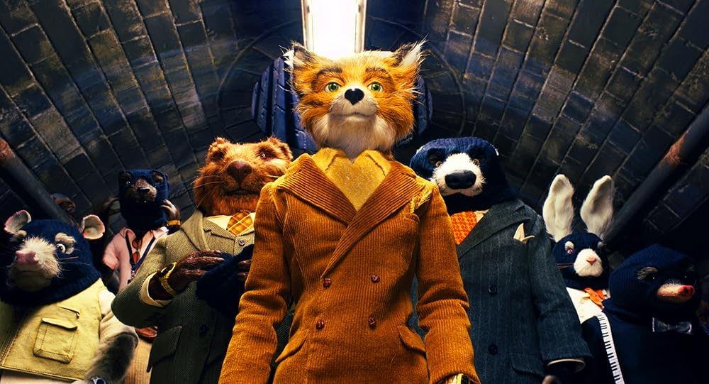

## The French Dispatch (2021)

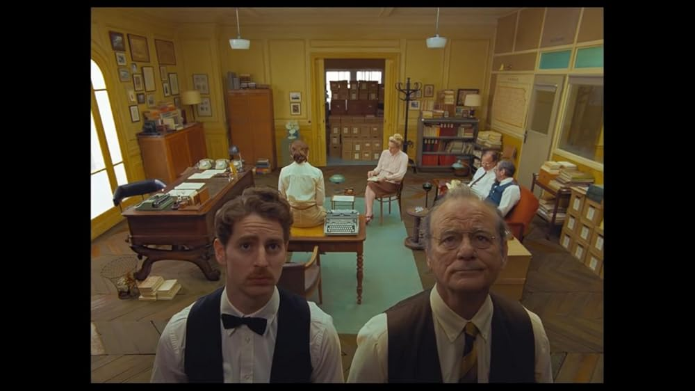

## The Grand Budapest Hotel (2014)

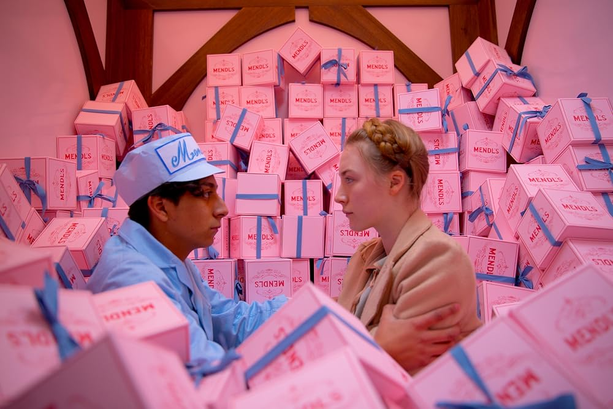

## Isle of Dogs (2018)

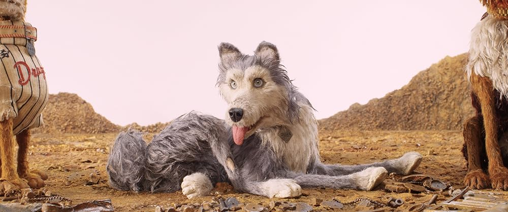

## The Life Aquatic with Steve Zissou (2004)

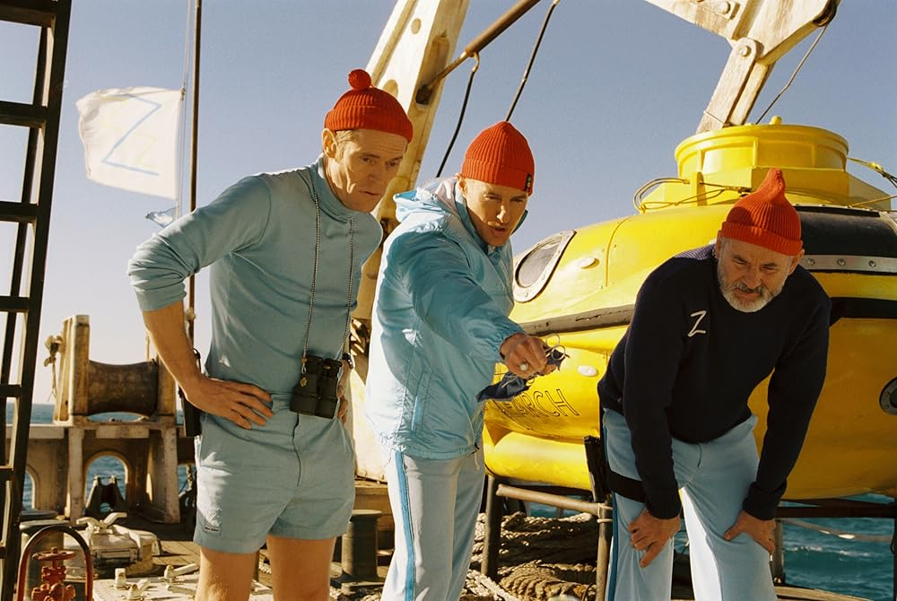

## Moonrise Kingdom (2012)

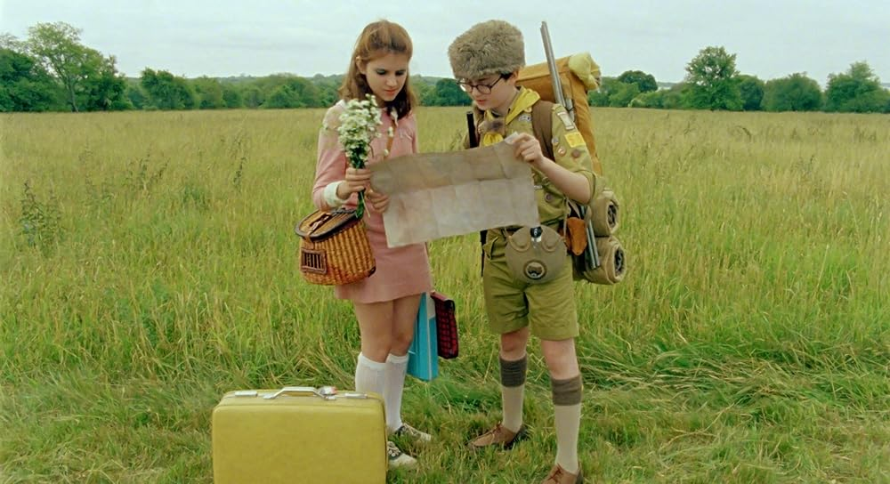

## The Royal Tenenbaums (2001)

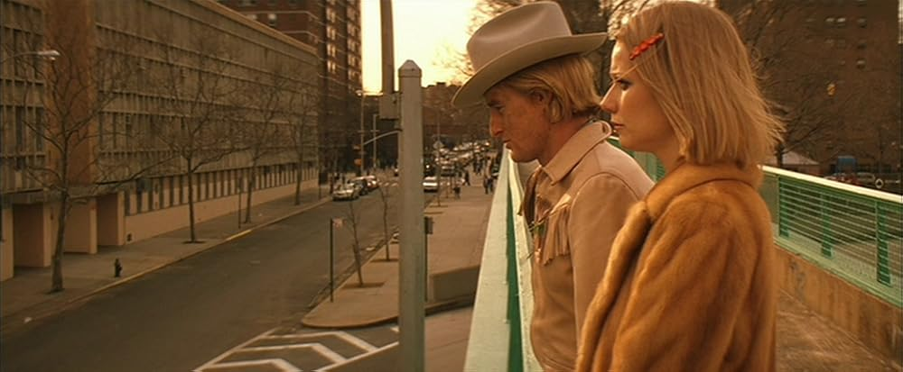
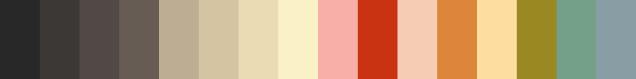

## Rushmore (1998)

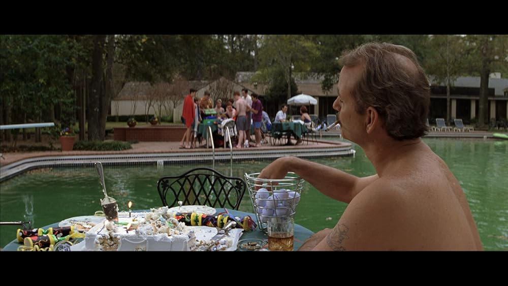

